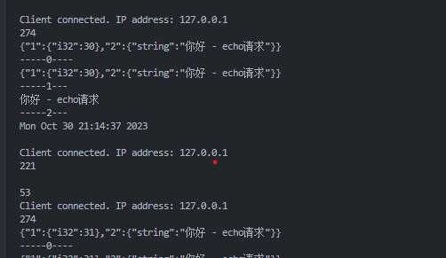
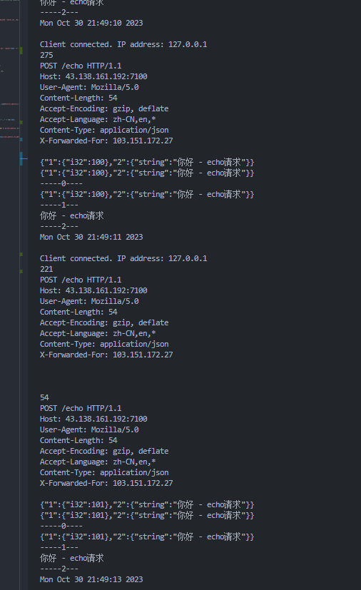

# BUG

1. 大量请求下 会出现 `terminate called after throwing an instance of 'apache::thrift::transport::TTransportException' ` 报错 服务器崩掉

   定位问题：

   1. 问题发生在接收方
   2. 接收到的 http 请求是分离开来的
      
      问题处理：
      问题产生原因： 未知
      问题解决方法： 接收方进行检验 如果接受的 http 请求 并不是一个完整的包 就进行等待 等待包变得完整 或者结束了流 才结束通讯
      解决效果：
      

2. 客户端编码问题 中文
   转 QString 解决 Base64 解决
3. 客户端 QBytearray 和 Qstring 的问题
   QString 会在 QBytearray 中某些字段截断 应该转 latin
   如：QString tmp = QString::fromLatin1(QByteArray::fromBase64(QByteArray::fromStdString(base)));
4. 微服务导致 web 崩溃问题 - 缺少异常处理
5. 客户端 网络发送失败的崩溃问题
   问题在于没有对网络的错误请求校验继续运行 段错误崩溃
6. 并发崩溃问题
   rpc 内部定义了全局变量使用冲突
7. web - IP 地址问题
8. 接收信息过大 崩溃问题
   定位问题： 序列化反序列化过程 分片过多导致没有完全接受报错
   解决方案： 用 json 结束}} 来进行划分
9. video 下载出错一次就会崩溃
   如果下载来的信息是错误的会直接进行跳过而不继续运行
10. 开启摄像头后变得卡顿
    疑似内存泄露 - 排查发现不是
    线程过多 vm 过大 - 排查发现不是
    怀疑服务端 socket 问题
