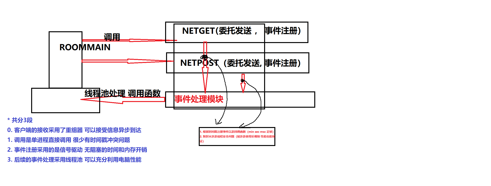

# 现存问题

注册中心的部署

~~传输过程中如何表达视频~~

~~视频在服务端的存储和转发问题~~

~~c/c++ 是怎么支持的HTTP通讯~~

~~HTTP 到 对应结构体的转换问题~~

HTTP请求 视频安全问题

客户端登陆问题

服务端的错误日志

混乱的日志

缺少统一的控制界面

缺少对启动环境的约束

客户端重构：

1. **统一配置问题**
   
2. **大量函数命名问题**
3. ~~**camera —> Room_main**~~
4. **析构函数**
5. **过多的头文件重复**
6. **public private权限**

~~http 长连接的问题：~~

~~http 长连接并发发送下的半包 粘包问题~~

 ~~验证存不存在这样的问题：存在 通过设定http头部设定长度解决~~

HTTPS

jwt在视频和音频上传下载的部署

dal 更改的原子操作

string分类

返回值分类

黑名单分类

db并发问题

~~客户端提供阻塞的网络请求~~

~~客户端两个pmanager冲突~~

~~服务端网络架构 客户端网络架构~~

~~服务端的数据库的分层~~

~~用户鉴权问题~~

~~代码生成问题~~

~~下线安全性~~

~~心跳~~

---

# 重要的问题

视频发送到服务器采用HTTP 还是 Websocket

HTTP：

1. websocket对于服务器压力过大
2. 无状态的Http更适合多单元共同处理数据 符合集群
3. 但是websocket能够保证通讯的稳定性

考虑新的通讯方案 -rtmp rstp等

1. 现在采用长连接的http

客户端网络架构设计:

客户端重组器逻辑：

    接收包和对应时间 根据对应时间取出队首的元素作为使用 好处是可以接收乱序到达的信息 可以利用多线程提高发送和接收的效率
