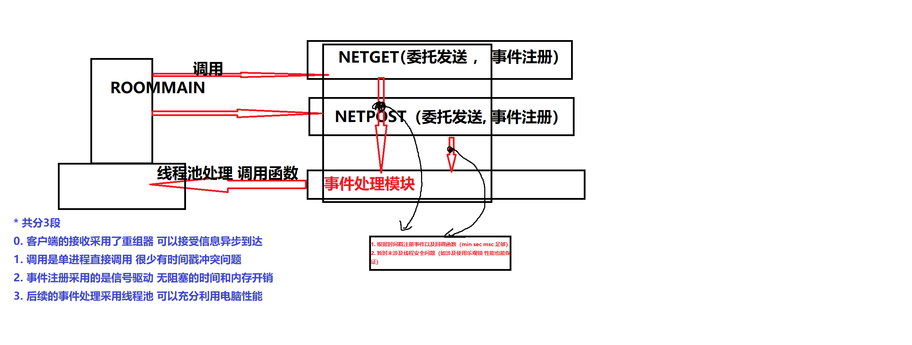

# DebateOL 服务端

### 运行环境：

- 服务端：
- 当前平台: ubuntu 22.04
- 当前架构: 微服务架构
- rpc服务框架: thrift 0.19.0
- 客户端：
- opencv - 4.8.0
- QT 6.6.0

---

### 网络架构：

- 服务端网络架构：
  epoll + 线程池 + rpc
- 客户端网络架构图：
  

---

### 数据流通：

## 内网穿透

基于frp实现 公网部署frps 内网部署frpc 进行内网穿透

## webserver

我们需要一个入口 把从网关接收到的http请求包转发到各个微服务 这个入口就是Webserver

他需要具备以下能力

1. 开放端口对接frp 接受网关信息
2. 根据路由选择对应的微服务
3. 解析http包 反序列化 请求体转发过去
4. 微服务处理过后把对应的包进行返回
5. 序列化返回应答
